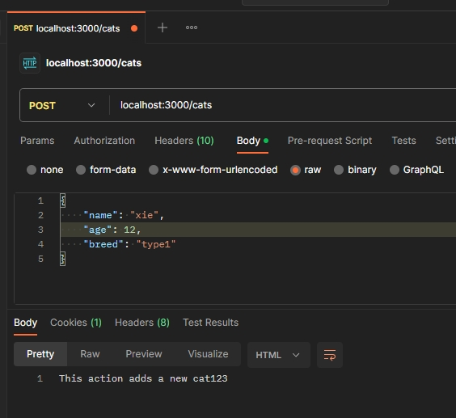

管道是用 @Injectable() 装饰器注释的类，它实现了 PipeTransform 接口。

## 使用场景

- transformation: 将输入数据转换为所需的形式（例如，从字符串到整数）
- validation: 评估输入数据，如果有效，只需将其原样传递； 否则抛出异常

## 绑定管道

以[内置管道](https://nest.nodejs.cn/pipes#%E5%86%85%E7%BD%AE%E7%AE%A1%E9%81%93) `ParseIntPipe` 例子

```ts
import { ParseIntPipe } from "@nest/common"

@Get(':id')
async findOne(@Param('id', ParseIntPipe) id: number) {  // [!code focus]
  return this.catsService.findOne(id);
}
```

假设 `GET localhost:3000/abc`，则会收到验证报错。

```json
{
  "statusCode": 400,
  "message": "Validation failed (numeric string is expected)",
  "error": "Bad Request"
}
```

## 对象模式验证

构建一个使用基于 [Zod](https://zod.dev/) 的模式的验证管道。

安装 zod `npm install --save zod`

::: code-group

```ts [创建管道]
// zod-validation.pip.ts
import {
  PipeTransform,
  ArgumentMetadata,
  BadRequestException,
} from '@nestjs/common';
import { ZodObject } from 'zod';

export class ZodValidationPipe implements PipeTransform {
  // DI
  constructor(private schema: ZodObject<any>) {}

  transform(value: unknown, metadata: ArgumentMetadata) {
    try {
      this.schema.parse(value);
    } catch (error) {
      throw new BadRequestException('Validation failed');
    }
    return value;
  }
}
```

```ts [修改DTO]
// create-cat.dto.ts
import { z } from 'zod';

export const createCatSchema = z
  .object({
    name: z.string(),
    age: z.number(),
    breed: z.string(),
  })
  .required();

export type CreateCatDto = z.infer<typeof createCatSchema>;
```

```ts [绑定管道]
// cats.controller.ts
@Post()
@UsePipes(new ZodValidationPipe(createCatSchema))
create(@Body() createCatDto: CreateCatDto) {
  return this.catsService.create(createCatDto);
}

```

使用 `postman` 测试



## [类验证器](https://nest.nodejs.cn/pipes#%E7%B1%BB%E9%AA%8C%E8%AF%81%E5%99%A8)

## 其他参考

[定制管道](https://nest.nodejs.cn/pipes#%E5%AE%9A%E5%88%B6%E7%AE%A1%E9%81%93)
